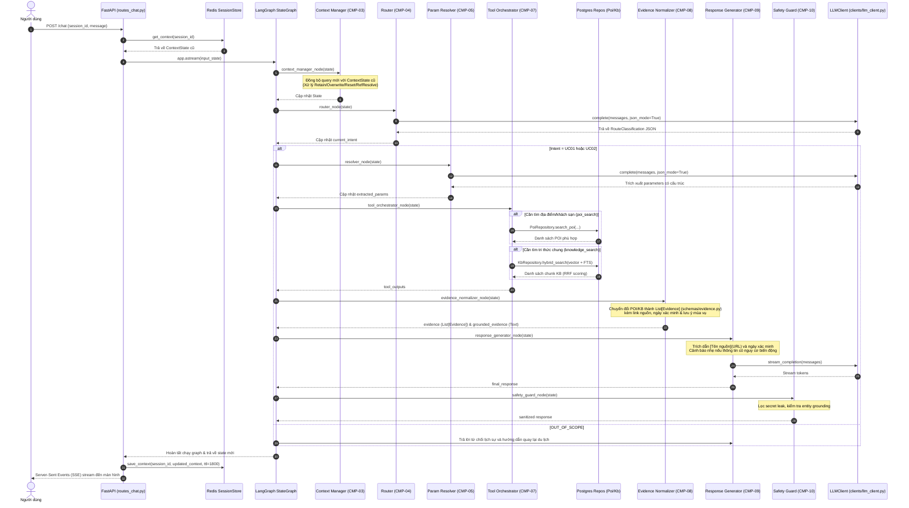

# TravelMate AI — Kiến Trúc & Sơ Đồ Workflow Tổng Quan

Tài liệu này giải thích chi tiết cấu trúc dự án và các thành phần hạ tầng theo đặc tả chuẩn mới tại [`docs/implementation/travelmate_ai_architecture.md`](../implementation/travelmate_ai_architecture.md), sơ đồ luồng dữ liệu (workflow) từ lúc người dùng gửi tin nhắn đến khi nhận phản hồi Server-Sent Events (SSE), và lộ trình tự code 7 Phase giúp bạn nắm vững kiến trúc AI Agent.

---

## 1. Cây Thư Mục Dự Án Chuẩn

```text
travelmate-ai/
├── pyproject.toml
├── Dockerfile
├── docker-compose.yml
├── Makefile
├── alembic.ini
├── .env.example
├── .env
├── .gitignore
│
├── data/
│   ├── seed/
│   │   ├── mock_poi_data.json
│   │   └── knowledge_base.json
│   └── evaluation/
│       └── golden_set.json
│
├── alembic/
│   ├── env.py
│   └── versions/
│
├── src/
│   └── travelmate/
│       ├── __init__.py
│       ├── main.py
│       ├── config.py
│       │
│       ├── api/
│       │   ├── __init__.py
│       │   ├── routes_chat.py
│       │   └── deps.py
│       │
│       ├── graph/
│       │   ├── __init__.py
│       │   ├── state.py
│       │   ├── builder.py
│       │   └── nodes/
│       │       ├── __init__.py
│       │       ├── context_manager.py
│       │       ├── router.py
│       │       ├── resolver.py
│       │       ├── tool_orchestrator.py
│       │       ├── evidence_normalizer.py
│       │       ├── response_generator.py
│       │       └── safety_guard.py
│       │
│       ├── tools/
│       │   ├── __init__.py
│       │   ├── base.py
│       │   ├── poi_search.py
│       │   └── knowledge_search.py
│       │
│       ├── rag/
│       │   ├── __init__.py
│       │   ├── ingestion.py
│       │   ├── embeddings.py
│       │   └── retriever.py
│       │
│       ├── clients/
│       │   ├── __init__.py
│       │   ├── llm_client.py
│       │   ├── embedding_client.py
│       │   └── langfuse_client.py
│       │
│       ├── infrastructure/
│       │   ├── __init__.py
│       │   ├── database/
│       │   │   ├── __init__.py
│       │   │   ├── session.py
│       │   │   ├── models.py
│       │   │   └── repositories/
│       │   │       ├── __init__.py
│       │   │       ├── base.py
│       │   │       ├── poi_repo.py
│       │   │       ├── kb_repo.py
│       │   │       └── log_repo.py
│       │   └── redis/
│       │       ├── __init__.py
│       │       ├── client.py
│       │       ├── session_store.py
│       │       └── cache.py
│       │
│       ├── schemas/
│       │   ├── __init__.py
│       │   ├── context.py
│       │   ├── tools.py
│       │   ├── evidence.py
│       │   └── trace.py
│       │
│       ├── guardrails/
│       │   ├── __init__.py
│       │   ├── prompt_injection.py
│       │   └── output_filter.py
│       │
│       ├── observability/
│       │   ├── __init__.py
│       │   ├── tracer.py
│       │   └── logger.py
│       │
│       └── prompts/
│           ├── system_prompt_v1.md
│           └── registry.py
│
├── tests/
│   ├── __init__.py
│   ├── conftest.py
│   ├── unit/
│   ├── integration/
│   └── regression/
│
└── scripts/
    ├── seed_poi.py
    ├── seed_kb.py
    └── eval_langfuse.py
```

---

## 2. Các Nguyên Tắc Kiến Trúc Cốt Lõi (Architectural Rules)

1. **Rule 1 — Graph nodes stay thin**: Các node chỉ nhận vào `State` và trả về `dict` cập nhật. Logic gọi SDK bên ngoài hoặc truy vấn DB được đẩy ra các Services, Repositories và Clients.
2. **Rule 2 — No direct infrastructure access from nodes**: Không tạo client Redis hay gọi raw SQL `session.execute` trực tiếp trong node.
3. **Rule 3 — Depend on abstractions**: Phụ thuộc vào các Protocol trừu tượng (`PoiRepositoryProtocol`, `KbRepositoryProtocol`, `SessionStoreProtocol`, `LLMClientProtocol`).
4. **Rule 4 — External SDKs stay behind clients**: Tầng `clients/` (`llm_client.py`, `embedding_client.py`, `langfuse_client.py`) đóng gói toàn bộ logic gọi mạng của các SDK bên thứ 3 (DeepSeek, HuggingFace, Langfuse).
5. **Rule 5 — Schemas define contracts**: Mọi giao tiếp giữa các tầng đều dùng Pydantic v2 schemas: `schemas/context.py`, `schemas/tools.py`, `schemas/evidence.py`, `schemas/trace.py`.

---

## 3. Sơ Đồ Tuần Tự Xử Lý Request (Request Processing Workflow)



---

## 4. Nguyên Tắc Quản Lý Độ Mới & Phiên Bản (Freshness & Versioning Architecture)

Nhằm đảm bảo chatbot luôn cung cấp thông tin cập nhật, chính xác và minh bạch (đặc biệt đối với các thông tin nhạy cảm theo mùa như giá phòng, thời tiết, lịch cáp treo), hệ thống áp dụng 3 quy tắc sau:

1. **Active Versioning & Time-Decay Scoring (Query-Time)**:
   - Cơ sở dữ liệu `kb_chunks` và `poi` quản lý `data_version`, `verified_at` và `is_active`.
   - Thuật toán Hybrid Search (Vector + FTS) tự động nhân hệ số suy giảm thời gian (Time-decay factor) dựa trên khoảng cách ngày từ `last_updated` đến hiện tại để ưu tiên tài liệu mới nhất.
2. **Citation Transparency & Staleness Warning (UI/LLM)**:
   - Schema `Evidence` (`schemas/evidence.py`) chuẩn hóa các trường `source_url`, `verified_at`, `authority_level`, và `scope_and_limitations`.
   - `Response Generator` và System Prompt quy định LLM phải dẫn link nguồn dạng Markdown `[Tên nguồn](URL)` và nêu ngày xác thực, đồng thời cảnh báo người dùng kiểm tra lại link trước khi đặt phòng.
3. **Offline Freshness Auditor (Admin/Cron)**:
   - Script ngoại tuyến `scripts/audit_freshness.py` kiểm tra tình trạng HTTP của các link nguồn (phát hiện 404/500) và xuất báo cáo các bản ghi quá 180 ngày cần rà soát lại dữ liệu mà không làm ảnh hưởng đến tốc độ chat của người dùng.

---

## 5. Lộ Trình 7 Phase Tự Code Dành Cho Bạn

Mỗi Phase trong `docs/coding-guide/` đều chứa diagram và toàn bộ code 100% đầy đủ:
- **Phase 1**: State Schema (`graph/state.py`) & Context Manager Node (`graph/nodes/context_manager.py`).
- **Phase 2**: Router Node (`graph/nodes/router.py`) & Parameter Resolver Node (`graph/nodes/resolver.py`) qua `LLMClientProtocol`.
- **Phase 3**: Tool Protocols (`tools/base.py`), `poi_search.py`, `knowledge_search.py` & Hybrid Retriever có Recency Weighting (`rag/retriever.py`).
- **Phase 4**: Tool Orchestrator (`graph/nodes/tool_orchestrator.py`), Evidence Normalizer với URL & Citation (`graph/nodes/evidence_normalizer.py`), Safety Guard (`graph/nodes/safety_guard.py`).
- **Phase 5**: Versioned System Prompt với quy tắc dẫn nguồn (`prompts/system_prompt_v1.md`), Registry (`prompts/registry.py`), Response Generator (`graph/nodes/response_generator.py`).
- **Phase 6**: Graph Builder (`graph/builder.py`) và API SSE Route (`api/routes_chat.py`).
- **Phase 7**: Unit Tests, Integration Tests và Regression Runner với `data/evaluation/golden_set_v1_2_220cases.json` & `scripts/audit_freshness.py`.
