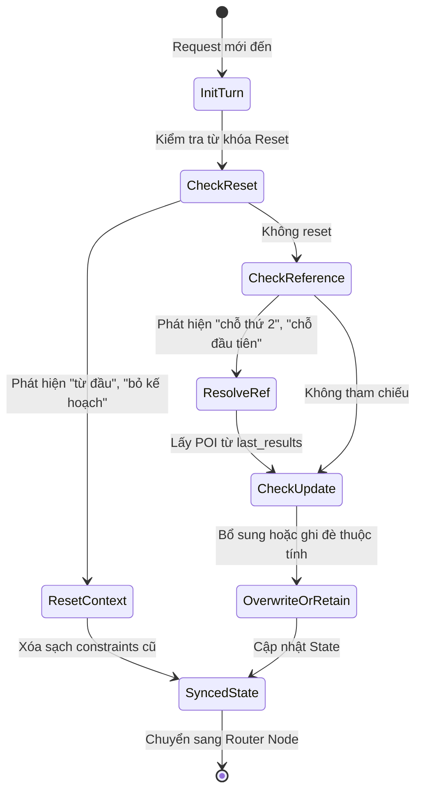

# Phase 1 — State Schema & Context Manager (CMP-03)

---

## 1. Mục Tiêu & Nghiệp Vụ Cốt Lõi

Trong LangGraph, **State** là "bộ nhớ duy nhất" chảy xuyên suốt qua mọi Node trong đồ thị. Node chỉ nhận vào `State` và trả về `dict` chứa những trường cần cập nhật (delta update).

Nghiệp vụ cốt lõi của **Context Manager (CMP-03)** là quản lý bộ nhớ đa lượt (multi-turn memory) theo 5 hành vi:
1. **Retain (Giữ nguyên)**: Người dùng bổ sung thông tin ("Gần biển nhé" khi đã chọn Đà Nẵng) -> giữ `location="Đà Nẵng"`, bổ sung `preferences=["near_beach"]`.
2. **Overwrite (Ghi đè)**: Người dùng đổi ý ("Thôi chuyển sang Hội An") -> ghi đè `location="Hội An"`.
3. **Reset (Làm mới)**: Người dùng yêu cầu làm lại từ đầu ("Bỏ hết kế hoạch cũ đi") -> xóa sạch constraints cũ.
4. **Intent Switch (Đổi mục tiêu)**: Người dùng chuyển từ tìm phòng sang tìm quán ăn -> đổi intent nhưng giữ location.
5. **Reference Resolution (Giải mã tham chiếu)**: Người dùng hỏi về kết quả trước ("Trong 3 chỗ trên, chỗ thứ 2 có bể bơi không?") -> ánh xạ trỏ đúng vào phần tử thứ 2 của `last_results`.

---

## 2. Sơ Đồ Trạng Thái Context State Machine



---

## 3. Mã Nguồn Cần Code Trong Phase Này

### File 1: `src/travelmate/graph/state.py`

> **Vị trí tạo file**: `src/travelmate/graph/state.py`  
> **Giải thích**: Định nghĩa kiểu dữ liệu `TravelMateState` (TypedDict) làm hợp đồng chia sẻ dữ liệu giữa tất cả các Node trong StateGraph. Chứa danh sách `evidence` chuẩn hóa (`schemas/evidence.py`) và văn bản `grounded_evidence`.

```python
"""LangGraph State schema definition for TravelMate AI.

Defines the shared state dictionary passed across all workflow nodes in the
deterministic StateGraph orchestration pipeline.
"""

from __future__ import annotations

from typing import Any, TypedDict


class TravelMateState(TypedDict, total=False):
    """Global state flowing through the LangGraph StateGraph.

    Attributes:
        session_id: Unique identifier for the user session.
        raw_user_input: Raw string message received in the current turn.
        current_intent: Intent predicted by Router ('UC01_FIND_PLACE', etc.).
        context: Active ContextState dictionary representation.
        extracted_params: Validated parameters resolved by Parameter Resolver.
        tool_outputs: Raw output dictionaries returned by executed tools.
        evidence: Normalized list of Evidence objects or dicts (schemas/evidence.py).
        grounded_evidence: Formatted textual facts passed to Response Generator.
        final_response: Generated assistant response string.
        is_safe: Flag set by Safety Guard indicating input/output compliance.
        error: System error code or message if an execution failure occurs.
        turn_count: Interaction turn counter for this session.
    """

    session_id: str
    raw_user_input: str
    current_intent: str
    context: dict[str, Any]
    extracted_params: dict[str, Any]
    tool_outputs: list[dict[str, Any]]
    evidence: list[dict[str, Any]]
    grounded_evidence: str
    final_response: str
    is_safe: bool
    error: str | None
    turn_count: int
```

---

### File 2: `src/travelmate/graph/nodes/context_manager.py`

> **Vị trí tạo file**: `src/travelmate/graph/nodes/context_manager.py`  
> **Giải thích**: Xử lý logic nghiệp vụ Context Manager (CMP-03). Node nhận vào `TravelMateState`, phân tích lệnh Reset / Reference Resolution và đồng bộ `context` trong State.

```python
"""Context Manager Node implementation (CMP-03).

Handles multi-turn conversational context evolution: Retain, Overwrite, Reset,
and Reference Resolution rules across conversation turns.
"""

from __future__ import annotations

import re
from typing import Any
import structlog

from src.travelmate.graph.state import TravelMateState
from src.travelmate.schemas.context import (
    ContextState,
    LocationState,
)

logger = structlog.get_logger(__name__)

# Keywords indicating explicit intent to reset context
RESET_KEYWORDS = [
    "bỏ kế hoạch cũ",
    "bỏ hết",
    "làm lại từ đầu",
    "tư vấn lại từ đầu",
    "xóa hết",
    "bắt đầu lại",
    "kế hoạch mới hoàn toàn",
]

# Patterns for ordinal reference resolution (e.g., 'chỗ thứ 2', 'khách sạn thứ nhất')
ORDINAL_PATTERNS = [
    (re.compile(r"(chỗ|khách sạn|quán|địa điểm)\s+(thứ\s+nhất|đầu\s+tiên|số\s+1|1)", re.IGNORECASE), 0),
    (re.compile(r"(chỗ|khách sạn|quán|địa điểm)\s+(thứ\s+hai|thứ\s+2|số\s+2|2)", re.IGNORECASE), 1),
    (re.compile(r"(chỗ|khách sạn|quán|địa điểm)\s+(thứ\s+ba|thứ\s+3|số\s+3|3)", re.IGNORECASE), 2),
]


def check_is_reset(user_input: str) -> bool:
    """Check if the user prompt explicitly requests resetting context.

    Args:
        user_input: Raw query string from user.

    Returns:
        True if a reset phrase is detected, False otherwise.
    """
    normalized = user_input.lower().strip()
    return any(keyword in normalized for keyword in RESET_KEYWORDS)


def resolve_reference(user_input: str, last_results: list[dict[str, Any]]) -> dict[str, Any] | None:
    """Resolve ordinal reference (e.g. 'chỗ thứ 2') against last results.

    Args:
        user_input: User message.
        last_results: List of entity summaries returned in the previous turn.

    Returns:
        Referenced entity dictionary if pattern matches and index is valid, None otherwise.
    """
    if not last_results:
        return None

    for pattern, index in ORDINAL_PATTERNS:
        if pattern.search(user_input):
            if 0 <= index < len(last_results):
                logger.info("Resolved ordinal reference", index=index, target=last_results[index])
                return last_results[index]

    return None


async def context_manager_node(state: TravelMateState) -> dict[str, Any]:
    """Execute Context Manager node logic within LangGraph StateGraph.

    Evaluates user input for reset directives, merges persistent session
    state with the incoming turn, and prepares the updated ContextState.

    Args:
        state: Current TravelMateState snapshot.

    Returns:
        Dictionary update for 'context' and initial state fields.
    """
    session_id = state.get("session_id", "default_session")
    raw_input = state.get("raw_user_input", "")
    existing_ctx = state.get("context") or {}

    logger.debug("Running Context Manager Node", session_id=session_id, input_preview=raw_input[:60])

    # Rule BR-UC03-01: Explicit Reset Command
    if check_is_reset(raw_input):
        logger.info("Resetting conversation context upon user request", session_id=session_id)
        new_ctx = ContextState(session_id=session_id)
        return {
            "context": new_ctx.model_dump(),
            "extracted_params": {},
            "tool_outputs": [],
            "evidence": [],
            "grounded_evidence": "",
        }

    # If context is not yet loaded or empty, initialize baseline
    if not existing_ctx.get("session_id"):
        ctx_obj = ContextState(session_id=session_id)
    else:
        ctx_obj = ContextState.model_validate(existing_ctx)

    # Reference Resolution check (e.g., 'chỗ thứ 2')
    last_results = ctx_obj.last_results
    resolved_entity = resolve_reference(raw_input, [item.model_dump() for item in last_results])
    if resolved_entity:
        logger.info("Bound referenced entity to context", entity_id=resolved_entity.get("id"))

    return {
        "context": ctx_obj.model_dump(),
        "is_safe": True,
        "error": None,
    }
```

---

## 4. Tóm Tắt & Giải Thích Chi Tiết

1. **`TravelMateState`**:
   - Sử dụng `total=False` để cho phép các node trả về cập nhật từng phần (partial updates).
   - Bổ sung trường `evidence: list[dict[str, Any]]` bên cạnh `grounded_evidence: str` để lưu trữ dữ liệu có cấu trúc của các chứng cứ được chuẩn hóa theo `schemas/evidence.py`.

2. **`context_manager_node`**:
   - Là một hàm `async` thuần khiết nhận `state: TravelMateState` và trả về `dict[str, Any]`.
   - Khi phát hiện `check_is_reset`, tạo mới hoàn toàn `ContextState(session_id=session_id)` để làm sạch bộ nhớ.
