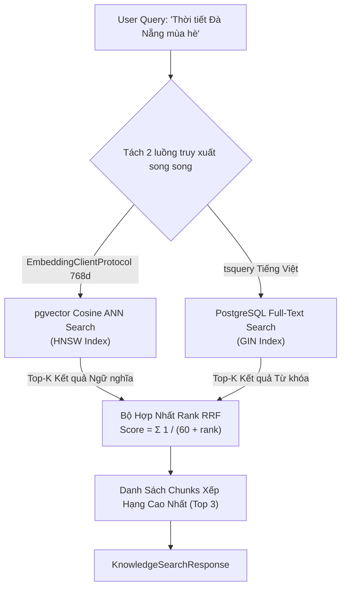

# Phase 3 — Tool Protocols & Hybrid Retriever (RRF)

---

## 1. Mục Tiêu & Nghiệp Vụ Cốt Lõi

1. **Tool Protocol (DIP Seam)**:
   - Tất cả các Tool trong hệ thống đều tuân thủ `ToolProtocol` (`tools/base.py`).
   - Tool **không** kết nối trực tiếp vào driver database hay SDK ngoài, mà nhận `PoiRepositoryProtocol`, `KbRepositoryProtocol`, và `EmbeddingClientProtocol` thông qua Dependency Injection.

2. **Tool `poi_search`**:
   - Tìm kiếm khách sạn, nhà hàng, điểm tham quan theo cấu trúc relational (location, category, budget_max, preferences).
   - Trả về `PoiSearchResponse` với status `OK` hoặc `EMPTY` (tuyệt đối không bịa đặt tên địa điểm giả theo Rule BR-No-Fabrication).

3. **Tool `knowledge_search` & `HybridRetriever`**:
   - Truy xuất tri thức tĩnh (cẩm nang du lịch, kinh nghiệm theo mùa, lưu ý vé tham quan).
   - Kết hợp Dense Vector Cosine Similarity (768d) với PostgreSQL Full-Text Search (tsvector).
   - Thuật toán **Reciprocal Rank Fusion (RRF)** xếp hạng lại tài liệu với công thức $RRF = \sum \frac{1}{60 + \text{rank}}$.

---

## 2. Sơ Đồ Thuật Toán Hybrid RRF Retrieval



---

## 3. Mã Nguồn Cần Code Trong Phase Này

### File 1: `src/travelmate/tools/base.py`

> **Vị trí tạo file**: `src/travelmate/tools/base.py`  
> **Giải thích**: Giao diện Protocol trừu tượng cho tất cả các Tool trong dự án, đảm bảo Tool Orchestrator không bị phụ thuộc vào cài đặt cụ thể của từng tool (DIP).

```python
"""Base tool protocol definition following Dependency Inversion Principle (DIP).

Ensures that Tool Orchestrator interacts with tools via a unified contract.
"""

from __future__ import annotations

from typing import Any, Protocol, runtime_checkable


@runtime_checkable
class ToolProtocol(Protocol):
    """Unified structural interface for all executable tools."""

    name: str
    description: str

    async def execute(self, params: dict[str, Any]) -> dict[str, Any]:
        """Execute tool action with the given parameter dictionary.

        Args:
            params: Validated parameter dictionary.

        Returns:
            Normalized dictionary payload adhering to tool response schemas.
        """
        ...
```

---

### File 2: `src/travelmate/tools/poi_search.py`

> **Vị trí tạo file**: `src/travelmate/tools/poi_search.py`  
> **Giải thích**: Cài đặt công cụ `poi_search`. Nhận `PoiRepositoryProtocol`, thực hiện tìm kiếm có lọc theo ngân sách và sở thích, trả về `PoiSearchResponse` chuẩn.

```python
"""POI Search Tool implementation (CMP-07).

Searches for accommodations, restaurants, and attractions using structured filters
over PostgreSQL relational tables via PoiRepositoryProtocol.
"""

from __future__ import annotations

from typing import Any
import structlog

from src.travelmate.infrastructure.database.repositories.base import PoiRepositoryProtocol
from src.travelmate.schemas.tools import (
    PoiItem,
    PoiSearchRequest,
    PoiSearchResponse,
    ToolError,
)
from src.travelmate.tools.base import ToolProtocol

logger = structlog.get_logger(__name__)


class PoiSearchTool(ToolProtocol):
    """Tool for querying points of interest matching structured constraints."""

    name: str = "poi_search"
    description: str = (
        "Search points of interest (hotels, restaurants, attractions) by location, "
        "category, budget_max, and preference keywords. Returns real, un-fabricated data."
    )

    def __init__(self, poi_repo: PoiRepositoryProtocol) -> None:
        """Initialize tool with injected repository dependency.

        Args:
            poi_repo: Repository implementing PoiRepositoryProtocol.
        """
        self._repo = poi_repo

    async def execute(self, params: dict[str, Any]) -> dict[str, Any]:
        """Execute POI search using validated request parameters.

        Args:
            params: Dictionary containing location, category, budget_max, preferences.

        Returns:
            PoiSearchResponse dictionary with status 'OK', 'EMPTY', or 'PROVIDER_ERROR'.
        """
        try:
            req = PoiSearchRequest.model_validate(params)
        except Exception as exc:
            logger.warning("Invalid poi_search parameters", error=str(exc))
            return PoiSearchResponse(
                status="BAD_REQUEST",
                error=ToolError(code="ERR-PARAM-01", message=str(exc)),
            ).model_dump()

        try:
            records = await self._repo.search_poi(
                location=req.location,
                category=req.category,
                budget_min=req.budget_min,
                budget_max=req.budget_max,
                preferences=req.preferences,
                limit=req.limit,
            )

            if not records:
                logger.info("POI search returned zero results", location=req.location, category=req.category)
                return PoiSearchResponse(status="EMPTY", items=[]).model_dump()

            items = [
                PoiItem(
                    id=rec.poi_id,
                    name=rec.name,
                    address=rec.address,
                    category=rec.category,
                    rating=float(rec.rating),
                    price_info=rec.price_info,
                    price_numeric=rec.price_numeric,
                    attributes=rec.attributes,
                    source=rec.source,
                    source_url=getattr(rec, "source_url", None),
                    source_type=getattr(rec, "source_type", "official"),
                    verified_at=str(rec.verified_at) if getattr(rec, "verified_at", None) else None,
                    scope_and_limitations=getattr(rec, "scope_and_limitations", None),
                )
                for rec in records
            ]

            return PoiSearchResponse(status="OK", items=items).model_dump()

        except Exception as exc:
            logger.error("poi_search database execution error", error=str(exc))
            return PoiSearchResponse(
                status="PROVIDER_ERROR",
                error=ToolError(code="ERR-TOOL-01", message=str(exc)),
            ).model_dump()
```

---

### File 3: `src/travelmate/tools/knowledge_search.py`

> **Vị trí tạo file**: `src/travelmate/tools/knowledge_search.py`  
> **Giải thích**: Cài đặt công cụ tra cứu tri thức tĩnh `knowledge_search`. Nhận `KbRepositoryProtocol` và `EmbeddingClientProtocol` (Rule 4) để nhúng query và thực hiện Hybrid Search.

```python
"""Knowledge Base Search Tool implementation (RAG, CMP-06, CMP-07).

Executes hybrid retrieval combining pgvector dense vector similarity and PostgreSQL
full-text search over knowledge base articles.
"""

from __future__ import annotations

from typing import Any
import structlog

from src.travelmate.clients.embedding_client import EmbeddingClientProtocol
from src.travelmate.infrastructure.database.repositories.base import KbRepositoryProtocol
from src.travelmate.schemas.tools import (
    KnowledgeChunkItem,
    KnowledgeSearchRequest,
    KnowledgeSearchResponse,
    ToolError,
)
from src.travelmate.tools.base import ToolProtocol

logger = structlog.get_logger(__name__)


class KnowledgeSearchTool(ToolProtocol):
    """Tool for searching travel guides and general travel tips."""

    name: str = "knowledge_search"
    description: str = (
        "Search curated travel knowledge base articles, weather guides, seasonal tips, "
        "and destination overviews using hybrid vector + lexical search."
    )

    def __init__(
        self,
        kb_repo: KbRepositoryProtocol,
        embedding_client: EmbeddingClientProtocol,
    ) -> None:
        """Initialize tool with repository and embedding dependencies.

        Args:
            kb_repo: Knowledge base chunk repository.
            embedding_client: Client implementing EmbeddingClientProtocol.
        """
        self._repo = kb_repo
        self._embedding_client = embedding_client

    async def execute(self, params: dict[str, Any]) -> dict[str, Any]:
        """Execute hybrid search using query string.

        Args:
            params: Dictionary containing 'query', optional 'category', 'location'.

        Returns:
            KnowledgeSearchResponse dictionary with status 'OK', 'EMPTY', or 'ERROR'.
        """
        try:
            req = KnowledgeSearchRequest.model_validate(params)
        except Exception as exc:
            return KnowledgeSearchResponse(
                status="ERROR",
                error=ToolError(code="ERR-PARAM-01", message=str(exc)),
            ).model_dump()

        try:
            # 1. Embed query with 'query: ' prefix
            query_vector = await self._embedding_client.embed_query(req.query)

            # 2. Hybrid search with RRF scoring
            ranked_hits = await self._repo.hybrid_search(
                query_text=req.query,
                query_vector=query_vector,
                category_filter=req.category,
                location_filter=req.location,
                limit=req.top_k,
            )

            if not ranked_hits:
                return KnowledgeSearchResponse(status="EMPTY", chunks=[]).model_dump()

            chunks = [
                KnowledgeChunkItem(
                    chunk_id=chunk.chunk_id,
                    source_id=chunk.source_id,
                    title=chunk.title,
                    content=chunk.content,
                    score=score,
                    source_url=getattr(chunk, "source_url", None),
                    source_type=getattr(chunk, "source_type", "official"),
                    last_updated=str(chunk.last_updated) if getattr(chunk, "last_updated", None) else None,
                    scope_and_limitations=getattr(chunk, "scope_and_limitations", None),
                )
                for chunk, score in ranked_hits
            ]

            return KnowledgeSearchResponse(status="OK", chunks=chunks).model_dump()

        except Exception as exc:
            logger.error("knowledge_search execution error", error=str(exc))
            return KnowledgeSearchResponse(
                status="ERROR",
                error=ToolError(code="ERR-RAG-01", message=str(exc)),
            ).model_dump()
```

---

### File 4: `src/travelmate/rag/retriever.py`

> **Vị trí tạo file**: `src/travelmate/rag/retriever.py`  
> **Giải thích**: Lớp trừu tượng hóa mức cao `HybridRetriever` bọc tiện ích nhúng query qua `EmbeddingClientProtocol` và gọi repository.

```python
"""Hybrid Retriever Service for Knowledge Base RAG.

High-level interface encapsulating query embedding and Reciprocal Rank Fusion
search over PostgreSQL pgvector.
"""

from __future__ import annotations

from typing import Sequence
import structlog

from src.travelmate.clients.embedding_client import EmbeddingClientProtocol
from src.travelmate.infrastructure.database.repositories.base import KbRepositoryProtocol
from src.travelmate.schemas.tools import KnowledgeChunkItem

logger = structlog.get_logger(__name__)


class HybridRetriever:
    """Service orchestrating dense vector generation and hybrid DB retrieval."""

    def __init__(
        self,
        kb_repo: KbRepositoryProtocol,
        embedding_client: EmbeddingClientProtocol,
    ) -> None:
        """Initialize the retriever service.

        Args:
            kb_repo: Repository implementing KbRepositoryProtocol.
            embedding_client: Client implementing EmbeddingClientProtocol.
        """
        self._repo = kb_repo
        self._embedding_client = embedding_client

    async def retrieve(
        self,
        query: str,
        category: str | None = None,
        location: str | None = None,
        top_k: int = 3,
    ) -> list[KnowledgeChunkItem]:
        """Retrieve most relevant knowledge chunks using hybrid RRF scoring.

        Args:
            query: User question or search topic.
            category: Optional category filter.
            location: Optional destination location filter.
            top_k: Maximum chunk count to return.

        Returns:
            List of ranked KnowledgeChunkItem instances.
        """
        query_vector = await self._embedding_client.embed_query(query)
        ranked_hits = await self._repo.hybrid_search(
            query_text=query,
            query_vector=query_vector,
            category_filter=category,
            location_filter=location,
            limit=top_k,
        )

        return [
            KnowledgeChunkItem(
                chunk_id=chunk.chunk_id,
                source_id=chunk.source_id,
                title=chunk.title,
                content=chunk.content,
                score=score,
                source_url=getattr(chunk, "source_url", None),
                source_type=getattr(chunk, "source_type", "official"),
                last_updated=str(chunk.last_updated) if getattr(chunk, "last_updated", None) else None,
                scope_and_limitations=getattr(chunk, "scope_and_limitations", None),
            )
            for chunk, score in ranked_hits
        ]
```

---

## 4. Tóm Tắt & Giải Thích Chi Tiết

1. **Tuân thủ DIP (Dependency Inversion Principle) & Rule 4**:
   - Cả `PoiSearchTool` và `KnowledgeSearchTool` chỉ nhận `Protocol` ở constructor (`PoiRepositoryProtocol`, `KbRepositoryProtocol`, `EmbeddingClientProtocol`).
   - Không bao giờ import thư viện mạng hay driver DB cụ thể bên trong Tool.

2. **Cơ Chế Lọc Phiên Bản Active & Trọng Số Thời Gian (Time-Decay Recency)**:
   - `KbRepository.hybrid_search` luôn áp dụng điều kiện `is_active=True` để loại bỏ các chunk phiên bản cũ.
   - Khi tính điểm dung hợp RRF, công thức nhân thêm hệ số suy giảm thời gian `math.exp(-0.001 * days_diff)` dựa trên `last_updated`, giúp các tài liệu vừa cập nhật (như `v1.3_2026-09-11`) được ưu tiên hơn các bài viết cũ.

3. **Chuyển Tiếp Siêu Dữ Liệu Nguồn (Provenance & Citation)**:
   - Cả hai tool đều đóng gói `source_url`, `source_type`, `verified_at` (hoặc `last_updated`), và `scope_and_limitations` vào payload trả về để `Evidence Normalizer` ở Phase 4 trích xuất và đưa vào prompt của LLM.

2. **Xử lý trung thực kết quả**:
   - Khi database trả về danh sách rỗng, tool trả về `status="EMPTY"`.
   - Đáp ứng 100% yêu cầu kỹ thuật: **Không bao giờ bịa đặt tên địa điểm, số điện thoại hay địa chỉ khi dữ liệu không tồn tại.**
