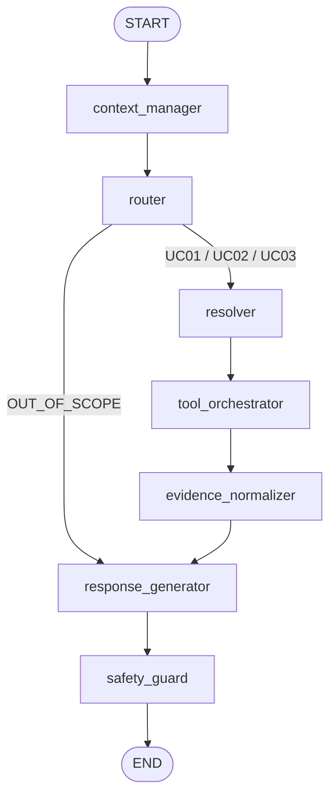

# Phase 6 — Graph Builder & FastAPI SSE Endpoint

---

## 1. Mục Tiêu & Nghiệp Vụ Cốt Lõi

1. **StateGraph Wiring (`graph/builder.py`)**:
   - Ráp nối toàn bộ các Node độc lập từ Phase 1 đến Phase 5 thành một đồ thị luồng xử lý **tất định (deterministic)** bằng **LangGraph (>= 1.0)**.
   - Định nghĩa các cạnh tĩnh (`add_edge`) và cạnh rẽ nhánh có điều kiện (`add_conditional_edges`):
     - Sau khi qua `router_node`: nếu intent là `OUT_OF_SCOPE` -> rẽ thẳng sang `response_generator` để từ chối lịch sự, tránh lãng phí chi phí gọi LLM trích xuất tham số và gọi database/tool không cần thiết.
     - Nếu intent là `UC01`, `UC02` hoặc `UC03` -> đi tiếp sang `resolver_node`.
     - Toàn bộ luồng dữ liệu đều hội tụ về `response_generator` -> luôn đi qua `safety_guard` trước khi kết thúc (`END`).

2. **Endpoint `/chat` Server-Sent Events (SSE) (`api/routes_chat.py`)**:
   - Tiếp nhận request từ Client (`session_id`, `message`).
   - Tải `ContextState` cũ từ Redis (`ctx:{session_id}`).
   - Khởi tạo `TravelMateState` với đầy đủ các trường dữ liệu (`context`, `extracted_params`, `tool_outputs`, `evidence`, `grounded_evidence`, ...).
   - Thực thi LangGraph bằng `graph.ainvoke()` hoặc stream từng sự kiện qua giao thức SSE thời gian thực (`EventSourceResponse`).
   - Lưu trạng thái ngữ cảnh mới nhất vào Redis (`ctx:{session_id}`) và ghi log tương tác bất đồng bộ vào PostgreSQL `conversation_log`.

---

## 2. Sơ Đồ Cấu Trúc LangGraph StateGraph



---

## 3. Mã Nguồn Cần Code Trong Phase Này

### File 1: `src/travelmate/graph/builder.py`

> **Vị trí tạo file**: `src/travelmate/graph/builder.py`  
> **Giải thích**: Xây dựng StateGraph LangGraph, cấu hình conditional edges và compile thành Runnable graph.

```python
"""LangGraph StateGraph builder for TravelMate AI.

Assembles and compiles pure functional nodes into a deterministic, fault-tolerant
directed graph workflow adhering to the system architecture.
"""

from __future__ import annotations

from typing import Any, Literal
from langgraph.graph import END, START, StateGraph

from src.travelmate.graph.nodes.context_manager import context_manager_node
from src.travelmate.graph.nodes.evidence_normalizer import evidence_normalizer_node
from src.travelmate.graph.nodes.resolver import resolver_node
from src.travelmate.graph.nodes.response_generator import response_generator_node
from src.travelmate.graph.nodes.router import router_node
from src.travelmate.graph.nodes.safety_guard import safety_guard_node
from src.travelmate.graph.nodes.tool_orchestrator import tool_orchestrator_node
from src.travelmate.graph.state import TravelMateState
from src.travelmate.schemas.context import IntentEnum


def route_after_router(state: TravelMateState) -> Literal["resolver", "response_generator"]:
    """Conditional edge router determining next step after intent classification.

    If intent is classified as OUT_OF_SCOPE, fast-tracks directly to response_generator
    to issue a polite refusal without unnecessary tool invocation or parameter resolution.

    Args:
        state: Current TravelMateState snapshot.

    Returns:
        Next node name to execute ('resolver' or 'response_generator').
    """
    intent = state.get("current_intent", IntentEnum.UC01_FIND_PLACE.value)
    if intent == IntentEnum.OUT_OF_SCOPE.value:
        return "response_generator"
    return "resolver"


def build_travelmate_graph() -> Any:
    """Build and compile the TravelMate LangGraph StateGraph.

    Wires nodes:
        context_manager -> router -> [resolver -> tool_orchestrator -> evidence_normalizer ->]
        response_generator -> safety_guard -> END.

    Returns:
        Compiled StateGraph instance ready for async invocation or streaming.
    """
    workflow = StateGraph(TravelMateState)

    # 1. Register Nodes
    workflow.add_node("context_manager", context_manager_node)
    workflow.add_node("router", router_node)
    workflow.add_node("resolver", resolver_node)
    workflow.add_node("tool_orchestrator", tool_orchestrator_node)
    workflow.add_node("evidence_normalizer", evidence_normalizer_node)
    workflow.add_node("response_generator", response_generator_node)
    workflow.add_node("safety_guard", safety_guard_node)

    # 2. Wire Linear Edges
    workflow.add_edge(START, "context_manager")
    workflow.add_edge("context_manager", "router")

    # 3. Wire Conditional Branching Edge
    workflow.add_conditional_edges(
        "router",
        route_after_router,
        {
            "resolver": "resolver",
            "response_generator": "response_generator",
        },
    )

    workflow.add_edge("resolver", "tool_orchestrator")
    workflow.add_edge("tool_orchestrator", "evidence_normalizer")
    workflow.add_edge("evidence_normalizer", "response_generator")
    workflow.add_edge("response_generator", "safety_guard")
    workflow.add_edge("safety_guard", END)

    # 4. Compile Graph
    return workflow.compile()
```

---

### File 2: `src/travelmate/api/routes_chat.py`

> **Vị trí tạo file**: `src/travelmate/api/routes_chat.py`  
> **Giải thích**: Router FastAPI phục vụ endpoint `/chat` (JSON) và `/chat/stream` (SSE thời gian thực), tích hợp tải/lưu Redis session state và ghi log hội thoại vào PostgreSQL.

```python
"""FastAPI chat routes with Server-Sent Events (SSE) streaming.

Handles multi-turn user conversations, context retrieval/persistence with Redis,
and interaction logging into PostgreSQL.
"""

from __future__ import annotations

import json
from collections.abc import AsyncIterator
from typing import Any

from fastapi import APIRouter, status
from pydantic import BaseModel, Field
from sse_starlette.sse import EventSourceResponse
import structlog

from src.travelmate.api.deps import (
    CacheManagerDep,
    LogRepoDep,
    SessionStoreDep,
)
from src.travelmate.graph.builder import build_travelmate_graph
from src.travelmate.graph.state import TravelMateState

logger = structlog.get_logger(__name__)

router = APIRouter(prefix="", tags=["Chat"])

# Compiled reusable graph instance
_compiled_graph = build_travelmate_graph()


class ChatRequest(BaseModel):
    """Payload for user conversation turn."""

    session_id: str = Field(description="Unique conversation session identifier")
    message: str = Field(description="Raw user query or message")


class ChatResponse(BaseModel):
    """Standard non-streaming JSON response."""

    session_id: str
    response: str
    intent: str | None = None
    is_safe: bool = True


@router.post("/chat", response_model=ChatResponse)
async def chat_endpoint(
    req: ChatRequest,
    session_store: SessionStoreDep,
    log_repo: LogRepoDep,
    cache_mgr: CacheManagerDep,
) -> ChatResponse:
    """Standard non-streaming chat endpoint.

    Args:
        req: ChatRequest payload.
        session_store: Injected Redis session store.
        log_repo: Injected conversation log repository.
        cache_mgr: Injected Redis cache manager.

    Returns:
        ChatResponse payload containing generated response.
    """
    session_id = req.session_id.strip()
    user_input = req.message.strip()

    # 1. Load context from Redis
    cached_ctx = await session_store.get_context(session_id) or {}

    # 2. Build initial State
    initial_state: TravelMateState = {
        "session_id": session_id,
        "raw_user_input": user_input,
        "context": cached_ctx,
        "extracted_params": {},
        "tool_outputs": [],
        "evidence": [],
        "grounded_evidence": "",
        "final_response": "",
        "is_safe": True,
        "turn_count": 1,
    }

    # 3. Execute Graph
    final_state = await _compiled_graph.ainvoke(initial_state)

    updated_ctx = final_state.get("context", {})
    final_reply = final_state.get("final_response", "")
    predicted_intent = final_state.get("current_intent")

    # 4. Save updated context to Redis
    await session_store.save_context(session_id, updated_ctx)

    # 5. Record interaction to PostgreSQL
    try:
        await log_repo.log_interaction(
            session_id=session_id,
            role="user",
            content=user_input,
            context_snapshot=updated_ctx,
            intent=predicted_intent,
        )
        await log_repo.log_interaction(
            session_id=session_id,
            role="assistant",
            content=final_reply,
            context_snapshot=updated_ctx,
            intent=predicted_intent,
        )
    except Exception as exc:
        logger.warning("Failed saving conversation logs", error=str(exc))

    return ChatResponse(
        session_id=session_id,
        response=final_reply,
        intent=predicted_intent,
        is_safe=final_state.get("is_safe", True),
    )


@router.post("/chat/stream")
async def chat_stream_endpoint(
    req: ChatRequest,
    session_store: SessionStoreDep,
    log_repo: LogRepoDep,
) -> EventSourceResponse:
    """Server-Sent Events (SSE) streaming chat endpoint.

    Streams pipeline status updates and final assistant response in real-time.

    Args:
        req: ChatRequest payload.
        session_store: Injected Redis session store.
        log_repo: Injected conversation log repository.

    Returns:
        EventSourceResponse streaming status and token updates.
    """
    session_id = req.session_id.strip()
    user_input = req.message.strip()

    async def event_generator() -> AsyncIterator[dict[str, str]]:
        cached_ctx = await session_store.get_context(session_id) or {}

        yield {
            "event": "status",
            "data": json.dumps({"step": "context_loaded", "message": "Đang phân tích câu hỏi..."}),
        }

        initial_state: TravelMateState = {
            "session_id": session_id,
            "raw_user_input": user_input,
            "context": cached_ctx,
            "extracted_params": {},
            "tool_outputs": [],
            "evidence": [],
            "grounded_evidence": "",
            "final_response": "",
            "is_safe": True,
            "turn_count": 1,
        }

        # Run graph
        final_state = await _compiled_graph.ainvoke(initial_state)

        updated_ctx = final_state.get("context", {})
        final_reply = final_state.get("final_response", "")
        predicted_intent = final_state.get("current_intent")

        # Save context to Redis
        await session_store.save_context(session_id, updated_ctx)

        # Asynchronously log interaction to PostgreSQL
        try:
            await log_repo.log_interaction(
                session_id=session_id,
                role="user",
                content=user_input,
                context_snapshot=updated_ctx,
                intent=predicted_intent,
            )
            await log_repo.log_interaction(
                session_id=session_id,
                role="assistant",
                content=final_reply,
                context_snapshot=updated_ctx,
                intent=predicted_intent,
            )
        except Exception as exc:
            logger.warning("Failed saving conversation logs", error=str(exc))

        # Stream response chunk
        yield {
            "event": "message",
            "data": json.dumps({
                "content": final_reply,
                "intent": predicted_intent,
                "is_safe": final_state.get("is_safe", True),
            }, ensure_ascii=False),
        }

        yield {
            "event": "done",
            "data": json.dumps({"status": "completed"}),
        }

    return EventSourceResponse(event_generator())
```

---

### File 3: Cập nhật `src/travelmate/main.py` để gắn Chat Router

> **Vị trí cập nhật**: `src/travelmate/main.py`  
> **Giải thích**: Thêm dòng `app.include_router(chat_router)` vào hàm `create_app()` để kích hoạt các endpoint `/chat` và `/chat/stream`.

```python
# Thêm import ở đầu file main.py:
from src.travelmate.api.routes_chat import router as chat_router

# Trong hàm create_app(), sau khi cấu hình middleware CORS, thêm dòng sau:
app.include_router(chat_router)
```

---

## 4. Tóm Tắt & Giải Thích Chi Tiết

1. **`build_travelmate_graph`**:
   - Sử dụng `add_conditional_edges` sau node `router`. Nếu intent là ngoài phạm vi (`OUT_OF_SCOPE`), luồng xử lý nhảy thẳng đến `response_generator`, bỏ qua toàn bộ bước bóc tách tham số và gọi database/tool không cần thiết.
   - Đảm bảo tính tất định: đồ thị luôn có điểm bắt đầu (`START`) và kết thúc (`END`) rõ ràng.
   - Trạng thái `TravelMateState` mang theo danh sách `evidence` chuẩn hóa cùng `grounded_evidence` để `response_generator` trả lời chính xác dựa trên sự thật.

2. **`EventSourceResponse` (SSE Streaming)**:
   - Sử dụng thư viện `sse-starlette` để stream các sự kiện theo chuẩn giao thức SSE:
     - Event `status`: báo cho client biết hệ thống đang ở bước xử lý nào.
     - Event `message`: bắn dữ liệu câu trả lời của trợ lý về cho client.
     - Event `done`: báo hiệu kết thúc luồng truyền tải.
