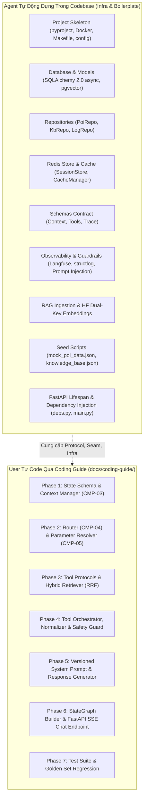

# Kế hoạch Triển khai TravelMate AI (Agent Infrastructure & Coding Guide)

Dựa trên tài liệu [`docs/implementation/implements-mvp-debug-and-code.md`](file:///Users/plxg/workspace/vsf/TravelMate%20AI/docs/implementation/implements-mvp-debug-and-code.md), [`AGENTS.md`](file:///Users/plxg/workspace/vsf/TravelMate%20AI/AGENTS.md) và các bộ kỹ năng senior trong `~/.agents/skills/` (`fastapi-async-development`, `pgvector-hybrid-search`, `redis-development`, `langfuse-observability`, `langgraph-python`), kế hoạch được chia thành 2 phần chính:

1. **Agent Implementation**: Tự động dựng toàn bộ tầng hạ tầng (Skeleton, Database, Redis, Repositories, Schemas, Guardrails, Observability, Seeding scripts, FastAPI Lifespan & DI) trực tiếp vào source code dự án.
2. **Coding Guide & Learning Docs**: Tạo bộ tài liệu markdown hướng dẫn chi tiết tại `docs/coding-guide/` kèm diagram trực quan và toàn bộ code hoàn chỉnh của các thành phần "Bộ não AI Agent" theo từng Phase để bạn tự chép theo, đọc hiểu luồng và học code.

---

## Phân chia trách nhiệm (Agent vs User)



---

## User Review Required

> [!IMPORTANT]
> - **LLM Engine**: Theo `mvp-implementation-plan.md`, engine mặc định là **DeepSeek-V3** (`deepseek-chat` qua OpenAI-compatible API) giúp tối ưu chi phí và hỗ trợ tiếng Việt bản địa rất mạnh, đồng thời có thể cấu hình fallback sang Anthropic Claude (`claude-3-5-sonnet`) thông qua biến môi trường.
> - **Embedding Engine**: Sử dụng Hugging Face Serverless Inference API với model **`intfloat/multilingual-e5-base`** (768 dims) cùng cơ chế xoay vòng Dual-Key (`HF_API_KEY_1`, `HF_API_KEY_2`) và cooldown tự động khi chạm HTTP 429.
> - **Nguyên tắc SOLID & Decoupling**: Các LangGraph node hoàn toàn pure (chỉ nhận và trả về State), giao tiếp với cơ sở dữ liệu qua các Repository Protocol (`PoiRepositoryProtocol`, `KbRepositoryProtocol`, `SessionStoreProtocol`).

---

## Proposed Changes & File Architecture

### 1. Agent Codebase Implementation (Phần code Agent dựng trực tiếp)

#### Project Skeleton & Configuration
- [NEW] `pyproject.toml`: Khai báo dependencies chuẩn (FastAPI, LangGraph >= 1.0, SQLAlchemy 2.0 async, pgvector, Redis, structlog, Langfuse, pydantic-settings, ruff, pytest-asyncio).
- [NEW] `.env.example`: Template biến môi trường đầy đủ (DeepSeek, HuggingFace Dual-Key, Postgres, Redis, Langfuse, API Secret).
- [NEW] `Makefile`: Bộ lệnh chuẩn tự động hóa (`up`, `down`, `migrate`, `seed`, `test`, `lint`, `format`).
- [NEW] `Dockerfile` & `docker-compose.yml`: Multi-stage Dockerfile cho Python 3.12, compose stack gồm Postgres 16 (pgvector), Redis 7, Langfuse, Langfuse-DB, App.
- [NEW] `alembic.ini` & `alembic/env.py`: Async Alembic migration setup với pgvector extension.
- [NEW] `alembic/versions/001_initial_schema.py`: Migration khởi tạo các bảng `poi`, `kb_chunks`, `conversation_log` kèm B-tree, GIN và HNSW indexes.
- [NEW] `src/travelmate/config.py`: Pydantic v2 `BaseSettings` cho cấu hình hệ thống.

#### Shared Infrastructure Layer (`src/travelmate/infrastructure/`)
- [NEW] `src/travelmate/infrastructure/database/session.py`: Async engine, sessionmaker, asyncpg pgvector codec registration, connection pool health check.
- [NEW] `src/travelmate/infrastructure/database/models.py`: Declarative ORM models (`PoiModel`, `KbChunkModel`, `ConversationLogModel`).
- [NEW] `src/travelmate/infrastructure/database/repositories/base.py`: Protocol interfaces (`PoiRepositoryProtocol`, `KbRepositoryProtocol`, `LogRepositoryProtocol`).
- [NEW] `src/travelmate/infrastructure/database/repositories/poi_repo.py`: Concrete `PoiRepository` lọc địa điểm có cấu trúc (location, category, budget_max, preferences).
- [NEW] `src/travelmate/infrastructure/database/repositories/kb_repo.py`: Concrete `KbRepository` thực hiện Hybrid Search (Cosine distance ANN + PostgreSQL tsvector FTS + Reciprocal Rank Fusion RRF).
- [NEW] `src/travelmate/infrastructure/database/repositories/log_repo.py`: Concrete `LogRepository` lưu trữ audit trail và lịch sử trò chuyện.
- [NEW] `src/travelmate/infrastructure/redis/client.py`: Async Redis connection pool và ping health check.
- [NEW] `src/travelmate/infrastructure/redis/session_store.py`: `SessionStore` quản lý serialization Context State (`ctx:{session_id}`) với TTL 30 phút.
- [NEW] `src/travelmate/infrastructure/redis/cache.py`: `CacheManager` quản lý cache tool response (`tool_cache:{hash}`) và rate limiter counter (`rate:{ip}`).

#### Schemas Contract (`src/travelmate/schemas/`)
- [NEW] `src/travelmate/schemas/context.py`: Pydantic v2 schemas cho Context State, Intent enum, Parameter Provenance.
- [NEW] `src/travelmate/schemas/tools.py`: Request/Response schemas chuẩn cho `poi_search` và `knowledge_search`.
- [NEW] `src/travelmate/schemas/trace.py`: Trace record schema ánh xạ chuẩn sang Langfuse trace / span.

#### Observability & Guardrails
- [NEW] `src/travelmate/observability/logger.py`: Cấu hình structlog JSON logging kèm correlation ID.
- [NEW] `src/travelmate/observability/tracer.py`: Wrapper Langfuse `@observe()`, generation helper và lifespan graceful flush.
- [NEW] `src/travelmate/guardrails/prompt_injection.py`: Regex + heuristic rule detector chặn tấn công prompt injection, bảo vệ system prompt.
- [NEW] `src/travelmate/guardrails/output_filter.py`: Bộ lọc ngăn rò rỉ secret, filter địa điểm giả mạo (Fake Entity check).

#### RAG Ingestion & Embeddings
- [NEW] `src/travelmate/rag/embeddings.py`: `HuggingFaceEmbeddingClient` hỗ trợ xoay vòng `HFKeyRotator` (dual-key), xử lý HTTP 429, retry 503 và E5 prefixes (`passage: `, `query: `).
- [NEW] `src/travelmate/rag/ingestion.py`: Pipeline đọc `knowledge_base.json`, sinh embedding và upsert vào `kb_chunks`.

#### Scripts & API Lifespan
- [NEW] `scripts/seed_poi.py`: Seed dữ liệu từ `mock_poi_data.json` (30 bản ghi) vào PostgreSQL.
- [NEW] `scripts/seed_kb.py`: Seed dữ liệu từ `knowledge_base.json` (25 bài viết) kèm vector embedding 768d vào PostgreSQL.
- [NEW] `scripts/eval_langfuse.py`: Chạy đánh giá tập dữ liệu `golden_set.json` trên Langfuse.
- [NEW] `src/travelmate/api/deps.py`: FastAPI Dependency Injection tiêm Repositories, SessionStore, DB Session.
- [NEW] `src/travelmate/main.py`: FastAPI app factory với modern `lifespan` quản lý khởi tạo/hủy connection pool của DB, Redis, HTTP client và Langfuse flush.
- [NEW] `tests/conftest.py`: Fixtures async cho pytest (mock DB, mock Redis, in-memory state).

---

### 2. Markdown Coding Guides (`docs/coding-guide/`)

Tạo bộ tài liệu hướng dẫn học và tự gõ code chia theo từng phase, đặt trong thư mục `docs/coding-guide/`:

1. **`docs/coding-guide/00-architecture-and-workflow.md`**:
   - Giải thích tổng quan kiến trúc Decoupled Layered Architecture.
   - Bảng tóm tắt các thành phần hạ tầng Agent đã dựng.
   - Sơ đồ tuần tự (Sequence Diagram) xử lý 1 request từ Client đến SSE Stream.
   - Hướng dẫn lộ trình thực hành 7 Phase cho người học.

2. **`docs/coding-guide/phase-1-graph-state-and-context-manager.md`**:
   - Mục tiêu & Nghiệp vụ Quản lý Ngữ cảnh Đa lượt (UC03: Retain, Overwrite, Reset, RefResolve).
   - Diagram State Machine của Context State.
   - Toàn bộ source code file `src/travelmate/graph/state.py`.
   - Toàn bộ source code file `src/travelmate/graph/nodes/context_manager.py`.
   - Hướng dẫn giải thích từng hàm, Google-style docstrings, type annotations.

3. **`docs/coding-guide/phase-2-router-and-parameter-resolver.md`**:
   - Mục tiêu Phân loại Intent (UC01, UC02, UC03, OUT_OF_SCOPE) & Trích xuất tham số có cấu trúc (Pydantic).
   - Diagram luồng Router -> Resolver -> Conditional Edge.
   - Toàn bộ source code file `src/travelmate/graph/nodes/router.py`.
   - Toàn bộ source code file `src/travelmate/graph/nodes/resolver.py`.
   - Kỹ thuật thiết kế prompt phân loại intent và ràng buộc trích xuất tham số.

4. **`docs/coding-guide/phase-3-tools-and-hybrid-retriever.md`**:
   - Mục tiêu: Tool Protocol (DIP seam) & Hybrid RAG Retrieval.
   - Diagram thuật toán Reciprocal Rank Fusion (RRF: Dense Vector + PostgreSQL FTS).
   - Toàn bộ source code file `src/travelmate/tools/base.py`.
   - Toàn bộ source code file `src/travelmate/tools/poi_search.py`.
   - Toàn bộ source code file `src/travelmate/tools/knowledge_search.py`.
   - Toàn bộ source code file `src/travelmate/rag/retriever.py`.

5. **`docs/coding-guide/phase-4-orchestrator-normalizer-safety.md`**:
   - Mục tiêu: Điều phối gọi Tool có cache (CMP-07), Chuẩn hóa bằng chứng (CMP-08) và Chốt chặn an toàn (CMP-10).
   - Diagram luồng Tool Cache -> DB/RAG Query -> Normalization -> Grounded Evidence.
   - Toàn bộ source code file `src/travelmate/graph/nodes/tool_orchestrator.py`.
   - Toàn bộ source code file `src/travelmate/graph/nodes/evidence_normalizer.py`.
   - Toàn bộ source code file `src/travelmate/graph/nodes/safety_guard.py`.

6. **`docs/coding-guide/phase-5-prompts-and-response-generator.md`**:
   - Mục tiêu: System Prompt v1 chống ảo giác (No Hallucination) & Sinh câu trả lời streaming dựa trên bằng chứng (Grounding).
   - Toàn bộ nội dung file `src/travelmate/prompts/system_prompt_v1.md`.
   - Toàn bộ source code file `src/travelmate/prompts/registry.py`.
   - Toàn bộ source code file `src/travelmate/graph/nodes/response_generator.py`.

7. **`docs/coding-guide/phase-6-graph-builder-and-api-sse.md`**:
   - Mục tiêu: Nối toàn bộ các node thành LangGraph `StateGraph` hoàn chỉnh và xây dựng endpoint `/chat` SSE streaming.
   - Diagram toàn bộ StateGraph (Nodes, Edges, Conditional Edges).
   - Toàn bộ source code file `src/travelmate/graph/builder.py`.
   - Toàn bộ source code file `src/travelmate/api/routes_chat.py`.

8. **`docs/coding-guide/phase-7-tests-and-evaluation.md`**:
   - Mục tiêu: Viết test kiểm thử đơn vị độc lập cho từng node, test tích hợp luồng graph, và test regression với `golden_set.json` (26 test cases).
   - Toàn bộ source code `tests/unit/test_nodes.py`.
   - Toàn bộ source code `tests/integration/test_workflow.py`.
   - Toàn bộ source code `tests/regression/test_golden_set.py`.

---

## Verification Plan

### Automated Verification
- Kiểm tra cú pháp Python, imports, và type hints qua script compile:
  ```bash
  python -m py_compile src/travelmate/**/*.py scripts/*.py
  ```
- Kiểm tra tính đúng đắn của các file markdown tutorial trong `docs/coding-guide/` (đầy đủ các blocks code, không thiếu file, diagram mermaid hợp lệ).

### Manual Verification
- Người dùng có thể đọc file `docs/coding-guide/00-architecture-and-workflow.md` để nắm workflow, sau đó tuần tự chép và chạy thử từng phase từ Phase 1 đến Phase 7.
